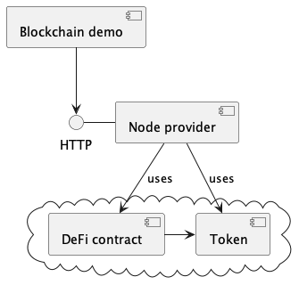
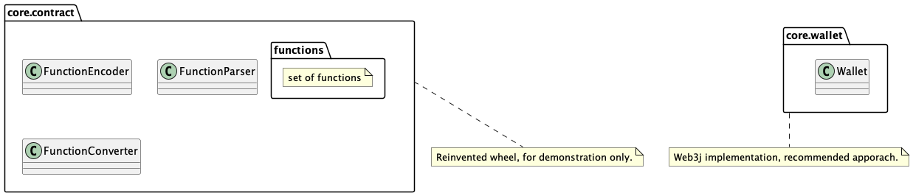

# Blockchain demo
Project created for demonstration purposes. Spring based,  written in script-like style, 
it depicts how to interact with ethereum blockchain.

## Demo struct

## App architecture

##  Core function
Interacts with blockchain via RPC and is integrated with wallet smart contract.

## Possible usages
- QA env setup 
- QA env observe
- QA env configure

## Packages structure
- `configuration` - spring config for domain, spring beans for rpc and smart contract.
- `startup` - functional providing action performing at app startup (script-like behavior).
- `core.rpc` - web3j client interacting with blockchain via rpc.
- `core.contract.functions` - contains smart contract functions describers.
- `core.contract.events` - contains smart contract events describers.
- `core.contract` - contains classes for working with smart contract events and functions describers.
- `core.wallet` - interacts with wallet contract via web3j lib.
- `core.scenarios` - group of actions that launches on startup.
- `core.utils` - common utils for debug purpose, also used as incubator for domain utils.

## Key sense
There are two approaches to work with contract: reinvented wheel and web3j lib. Though `core.contract` code reinvents the wheel actually, 
as its functional duplicates that can be easily done by web3j lib (e.g. `core.wallet`).
Probably, it would be nicer to remove all redundant code to make understanding clearer and simpler.